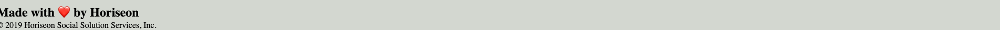
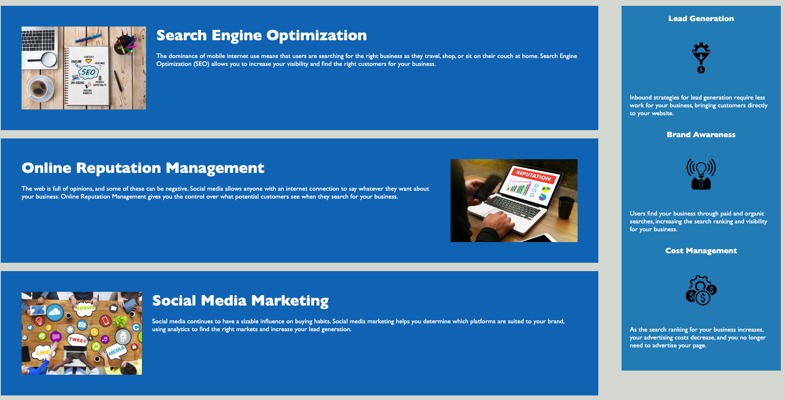

Horiseon-Webpage

# <Horiseon-Webpage>

## Description

This project was for the company Horiseon's main website build. The criteria for this project was to read the starter code for the website and see what could make it more semantic in structure. This project helped build basic understanding of the html setup and css styling to create a visibly appealing and semantic structured html code. After reviewing the starter code, I saw that there were redundant div tags, classes, and that he images did not have alt attributes. I then removed the redundant classes, added more descriptive tags, added alt attributes to images. Doing this made the code more easy to read and look more semantic.

Provide instructions and examples for use. Include screenshots as needed.

To add a screenshot, create an `assets/images` folder in your repository and upload your screenshot to it. Then, using the relative file path, add it to your README using the following syntax:


## Screenshot

````md




```
## Credits
N/A
```
````
